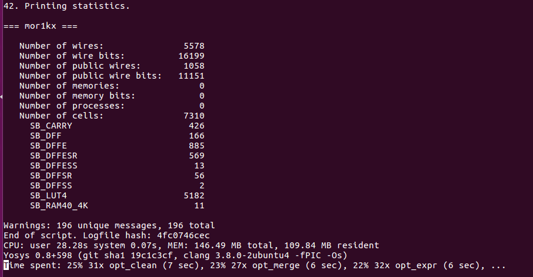
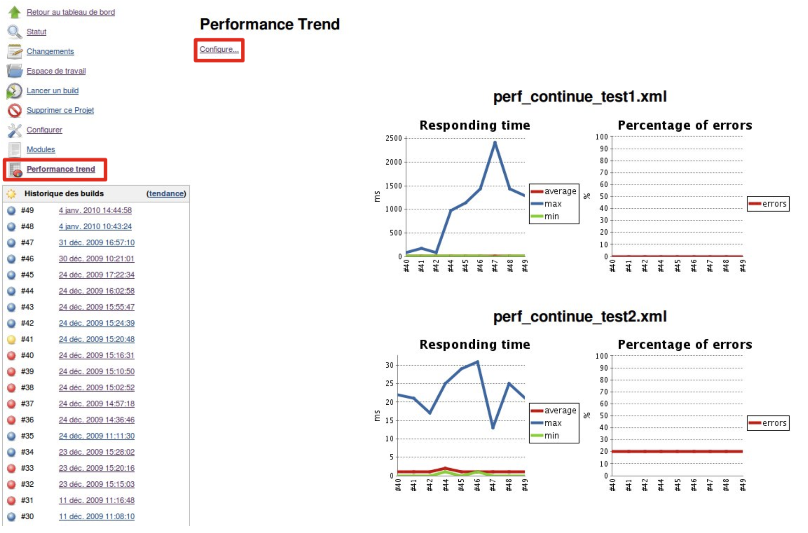
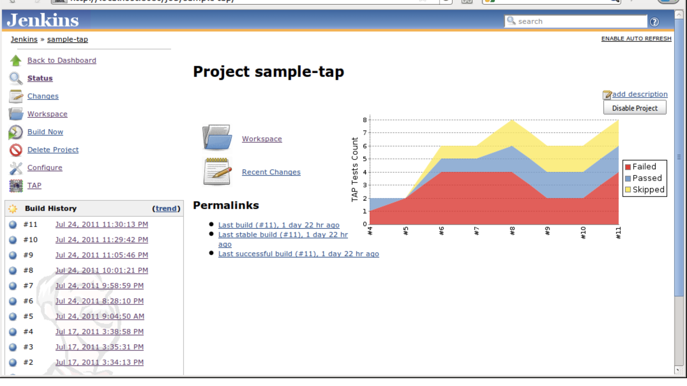

This is the fourth post on GSoC with FOSSi Foundation. This blog defines my work of Coding Phase 2. Throughout this phase CI Pipelines improved, new test automation was added to the OpenRISC projects and worked on Yosys Synthesis.

#### Yosys Synthesis with fusesoc

1) Yosys is a framework for Verilog RTL synthesis.

2) It was required in the openrisc project for monitoring resource usages.

3) [FuseSoC!](https://github.com/olofk/fusesoc) is a package manager and a set of build tools for HDL (Hardware Description Language) code. Its main purpose is to increase reuse of IP (Intellectual Property) cores and be an aid for creating, building and simulating SoC solutions.

4) Fusesoc: The icestorm backend [edalize!](https://github.com/olofk/edalize) uses yosys to handle synthesis, arachne-pnr for place & route and icepack for creating the bitstream.

For using fusesoc, core description is a required file which contains all the information it needs to have about the core in order to run simulations on the core, build it for an FPGA target or use it as a dependency of another core.

So for the yosys synthesis in openrisc project, the first step was to generate yosys.log file, so I did some changes in mor1kx.core file in mor1kx repository to include icestorm tool. 
[Check the code !](https://github.com/openrisc/mor1kx/pull/87/files#diff-c8ddd64aa00b9b454ca3c7264bc68c85)

#### Modifying mor1kx.core : fusesoc (icestorm tool build)

```
tinyfpga_bx:
    default_tool : icestorm
    filesets : [core, tinyfpga_bx]
    tools:
      icestorm:
        nextpnr_options : [--lp8k, --pcf-allow-unconstrained, --package, cm81, --freq, 32]
        pnr: next
    toplevel : mor1kx
```


The command used to only run synthesis in the icestorm backend by setting pnr to none :
```
fusesoc run - target=tinyfpga_bx mor1k - pnr=none
```
After generating yosys.log file with help of fusesoc, I created a parser to only get printing statistics from huge yosys.log file. I used Regular Expression to extract data from the log file.
[Check the code!](https://github.com/openrisc/mor1kx/pull/87/files#diff-b14da046228cc3073398f06064070769)

```
 Quick Start ( commands )

fusesoc library add mor1kx ../mor1kx
fusesoc run --target=tinyfpga_bx mor1kx --pnr=none
./extract_stats.py < build/mor1kx_5.0-r3/tinyfpga_bx-icestorm/yosys.log
```

```
Result ( After extracting printing statistics from log file )

mor1kx git:(yosys-ci) ✗ ./extract_stats.py < build/mor1kx_5.0-r3/tinyfpga_bx-icestorm/yosys.log
[('wires', '5578'), ('memories', '0'), ('processes', '0'), ('cells', '7310')]
[('SB_CARRY', '426'), ('SB_DFF', '166'), ('SB_DFFE', '885'), ('SB_DFFESR', '569'), ('SB_DFFESS', '13'), ('SB_DFFSR', '56'), ('SB_DFFSS', '2'), ('SB_LUT4', '5182'), ('SB_RAM40_4K', '11')]
```
After this work, it is intended to parse and visualize the test results of the openrisc project and yosys synthesis using the Jenkins plugins.

#### WIP: Parsing and visualizing test reports for mor1kx

1) Tap Plugin: To be used for test results of openrisc projects



2) Performance Plugin: To be used for synthesis and PNR metrics (e.g. used LUTs)  

 
  

I also worked on improving CI pipeline by refactoring the Jenkins/Travis pipelines in mor1kx and or1k-marocchino project by creating Librecores-ci-openrisc dockerfile [Check the code !](https://github.com/librecores/docker-images/tree/master/librecores-ci-openrisc) based on standard Librecores-CI dockerfile.

#### Contributions ( Code )
[PR 1](https://github.com/openrisc/mor1kx/pull/87/),
[PR 2](https://github.com/openrisc/mor1kx/pull/89),
[PR 3](https://github.com/openrisc/or1k_marocchino/pull/14),
[PR 4](https://github.com/librecores/docker-images/pull/20)

