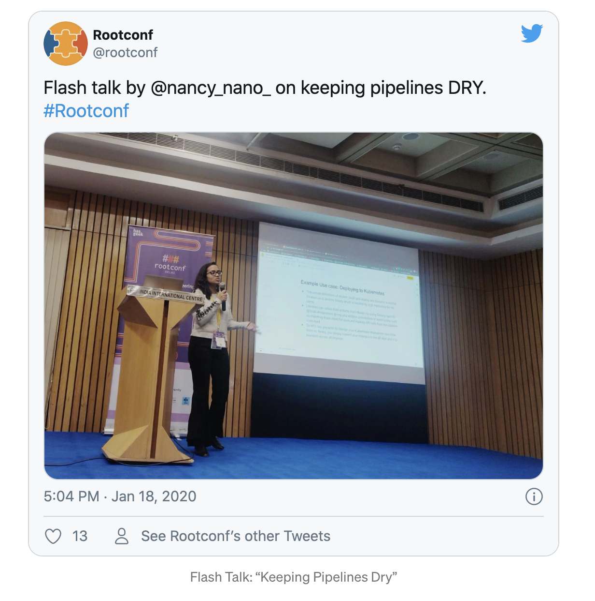
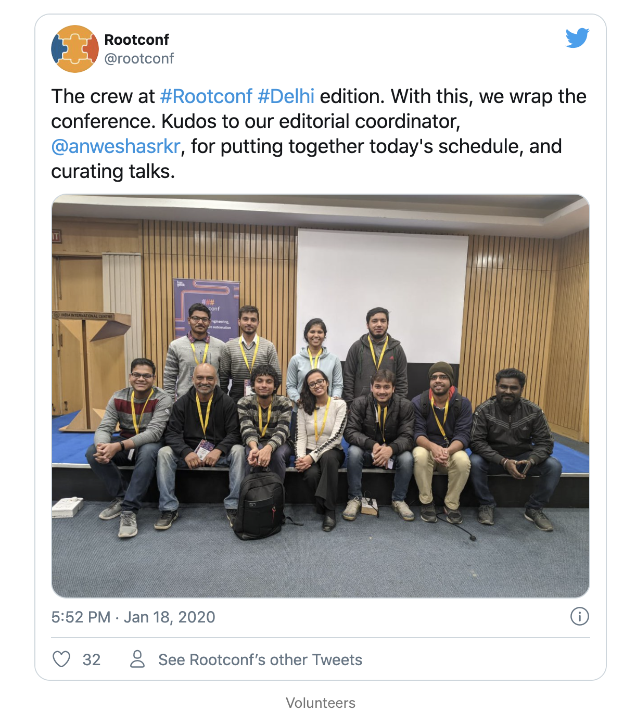
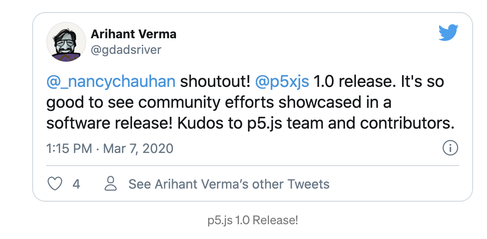
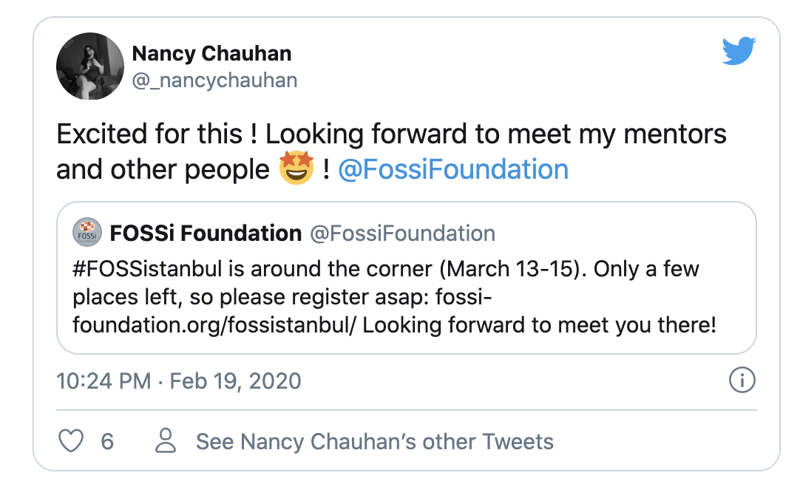
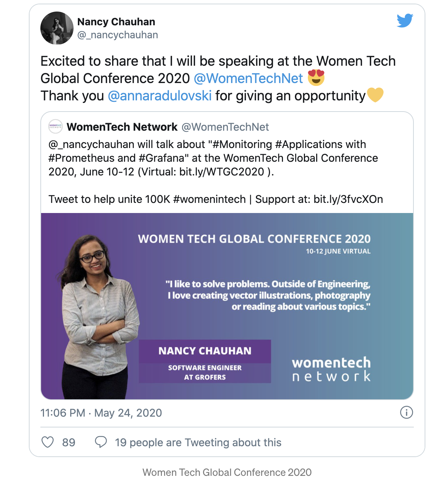
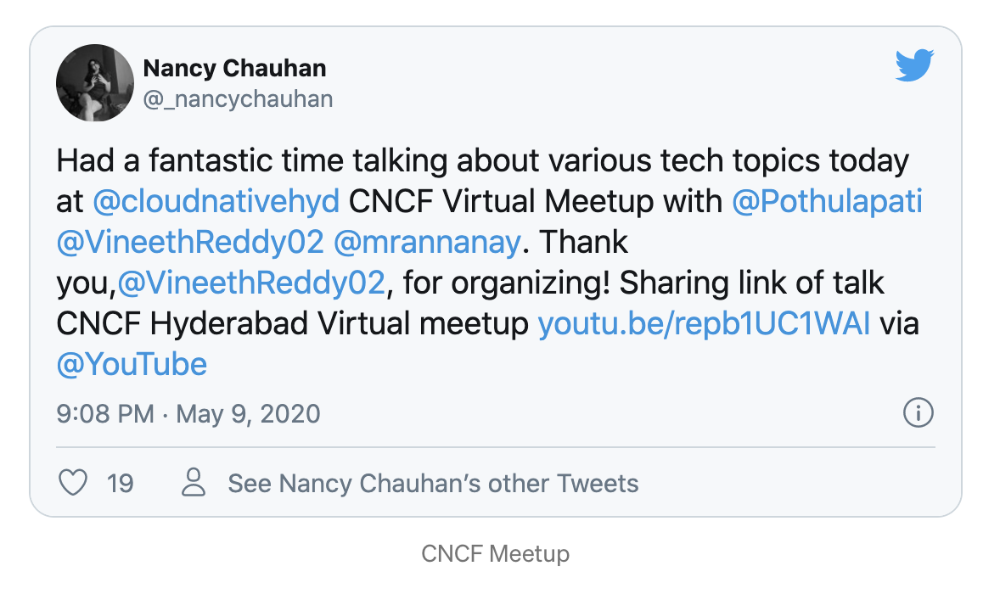
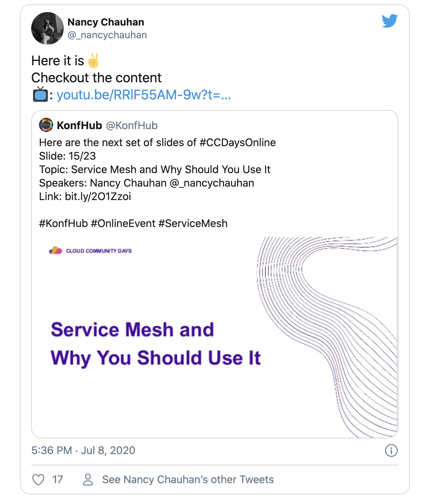
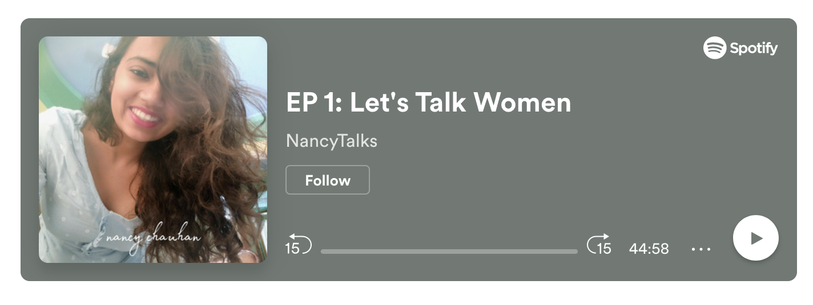
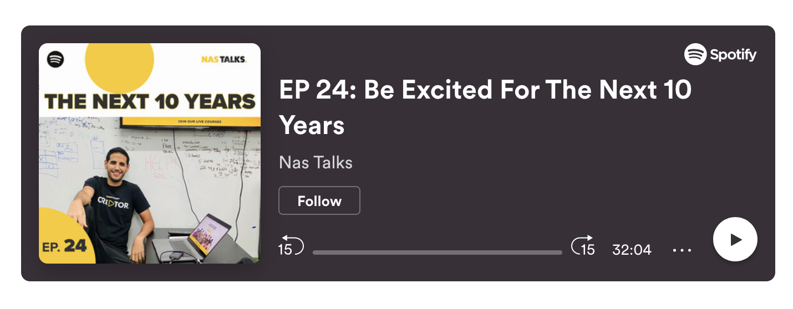
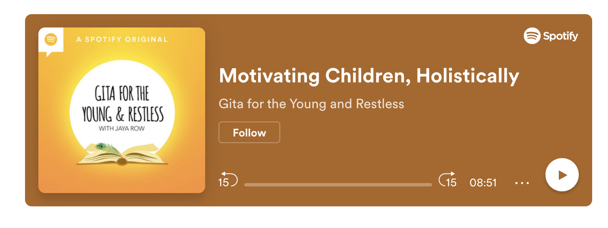

This year was a rollercoaster for me. I had gone through stuff that I thought I would never be able to come out of it! I did do mess up with lots of people and with lots of opportunities. But guess what? I am retrospecting 2020, and I think I did a good job.

2020 has been a strange year. When I started writing this blog, I was blank. All the while I thought I did nothing, but indeed I tried a lot of things this year. Before I start, I want to represent this year with just one word, **“Mess”**.

I started this year with an opportunity to attend, volunteer, and deliver a Flash talk at Rootconf Delhi 2020. You can check out my blog [here](https://medium.com/@_nancychauhan/rootconf-delhi-2020-2e22790d27f8). 
I made a few connections and established professional relations with people. It is interesting to see people talking about the problems they have solved in tech and inspiring others to do the same!

  

Then I got to know from my college senior about the p5.js 1.0 release. I had been a Processing Fellow in 2019.

It was a great feeling to see your contribution to the 1.0 release. You can read more about it [here](https://medium.com/processing-foundation/p5-js-1-0-is-here-b7267140753a).

Then one of the best things happened, I got to know about “FOSSistanbul,” a tech conference which was going to be organized by FOSSi Foundation in March. I was invited to deliver a talk about my GSoC 2019 Project. I was excited about it a lot like a crazy child! But unfortunately, COVID was spreading across the world rapidly; I reached Istanbul but the conference was called off. It was a bit shocking to me, but I loved the fact that I could visit the beautiful Istanbul and meet many amazing people associated with FOSSi Foundation. I am grateful for this opportunity given by my GSoC mentors and FOSSi People. Here are some glimpses:

Amazing FOSSi people | Beautiful Hagia Sophia
- | - 
 | 

Cruise Trip organised by FOSSi Foundation. | Bridges of Bosphorus
- | - 
 | 

When I returned, I had to quarantine myself due to the COVID pandemic, and everything turned upside down. We had to stay inside our homes and work according to the government’s rules. I was a bit uncomfortable the whole time. I love to talk to people and go outside, and this entire situation just took a huge toll on my mental health over my already ongoing personal problems.

Someone said correctly, this year was more about being grateful for what you have rather than wishing for what you want to have. I was a bit self-centred earlier, but later with a broader perspective, I realized everyone, each one of us, was having a bad time. COVID had shaken the whole world. It brought a drastic change in everyone’s life. For some it was extreme and for some others, it was less.

In WFH conditions, we had to always look for ways to take care of ourselves. I got involved in a lot of blog writing, projects, illustrations, etc. I also got the opportunity to present myself in some meetups and conferences.

### Meetups and Conferences

One of the most exciting opportunities I got this year was to present a talk at [Women Tech Global Conference 2020](https://www.womentech.net/en-in) which was being held online.

The whole process of delivering a talk on an international platform and meeting amazing folks of other continents online was mesmerizing and revitalizing to me.

 

### Blog
I also wrote dozen of blogs, which is a big deal because I have just started getting into a regular reading and writing habit. Some of the blogs I am proud of are:

* [Adopting Tekton — Cloud Native CI Solution](https://medium.com/@_nancychauhan/adopting-tekton-cloud-native-ci-solution-67fb229f4992)
* [Monitoring Java Web Apps using Prometheus and Grafana](https://lambda.grofers.com/monitoring-java-web-apps-using-prometheus-and-grafana-49050f418bfc)
* [DNS Resolution](https://nancychauhan.in/dns-resolution)
* [Remembering Ruth Bader Ginsburg](https://nancychauhan.in/remembering-ruth-bader-ginsburg)

There are many more blogs, and you can check all of them [here](nancychauhan.in)!

### Podcast
I also recorded one podcast, [“Let’s Talk Women”](https://open.spotify.com/episode/6Vloqp2O2GHmILmKwAdlHo?go=1&utm_source=embed_v3&referrer=https%3A%2F%2Fmedium.com%2F%40_nancychauhan%2F2020-at-a-glance-e49afcf83ffb&t=0&nd=1) with my friends. It was pretty much an experiment, and I hope to take this forward in 2021.

Some of the podcasts I regularly listened to are:

### Books

Here are some of the great books I read this year:

* [Swipe to Unlock: The Primer on Technology and Business Strategy](https://www.amazon.in/Swipe-Unlock-Technology-Business-Strategy-ebook/dp/B0756MTX6K)
* [Eleven Minutes by Paulo Coelho](https://www.amazon.in/Eleven-Minutes-Paulo-Coelho/dp/8172235631)
* [Thinking, Fast and Slow, Book by Daniel Kahneman](https://www.amazon.in/Thinking-Fast-International-Daniel-Kahneman/dp/0374533555)
* [The !Empathetic Engineer: A short story portraying the software engineer archetype](https://www.amazon.in/Empathetic-Engineer-portraying-software-archetype-ebook/dp/B083H3N7C9)

### Illustrations
I love drawing digital illustrations, but I always struggle to find time to make one! Some of the work that helped me to express my views are:

Girl waiting for the lockdown to end | Ruth Bader Ginsburg
- | - 
 | 

Harsh winters | Female genital mutilation (FGM)
- | - 
 | 

I retrospected and wrote all the good things of 2020, but talking about the bad part, I lost track of the primary goals I set for this year due to multiple rejections or unfavourable circumstances. It is quite disappointing for me. But this year has been very unpredictable and has taught me about myself more than any other time. In adversity, you discover yourself the best. By the end of 2020, I have two interesting ongoing things that I am passionate about!

### Overcoming Problems:

I wrote many blogs, drew illustrations and did random things to keep myself motivated and sane. My close friends had to bear up some of the days with all my rants and late-night cries.

Later I realized I need to stop this because everyone is going through their own struggles. I started maintaining my diary, and it worked wonders. Trust me, a diary will work like magic if you are an overthinker. It is a therapy in itself! Also, I wrote a word of gratitude in my journal regularly.

I am blessed to be surrounded by a few fantastic people who suggested me to get involved in workouts and start making personal OKRs. I was not doing regular workouts. I love walking in the morning listening to the podcast and skipping a rope. I tried to learn new skills, such as driving, to develop new neural connections. However, all of this was quite random. I strived almost daily to keep my sanity. Coming back to my home also helped me immensely. The best part is I got to spend time with my family, who love me the most!

We all managed to keep up with all stupid video calls with friends this year and teasing our siblings and friends. Thanks to all my close friends and family who helped me to keep my sanity.

Have a nice year ahead!
