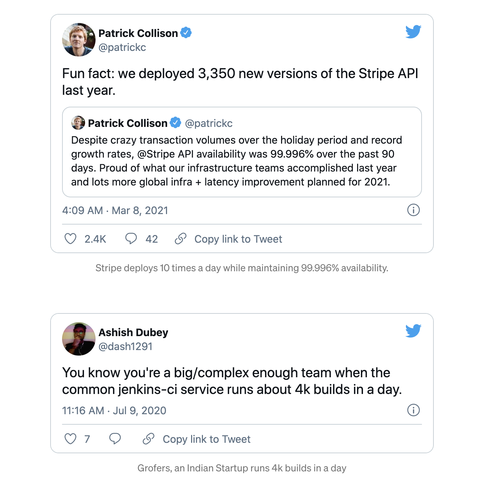

High-performing teams usually ship faster, better, and often! Organizations irrespective of their level, focusing on stability and continuous delivery, will deploy frequently. Hundreds of continuous integration build run for every organization on a typical day. It indicates how CI has become an integral part of our development process. Hence to ensure that we are shipping quality code, we should integrate code quality checking in our CI. 

Continuous integration ensures easier bug fixes, improves software quality, and reduces project risk. This blog will show what steps we should integrate into our CI pipelines to ensure that we ship better code.

Traditionally code reviews use to enforce code quality, However checking for things like missing spaces, missing parameters becomes a burden for code reviewers. It would be great if you some tools to automate these checks. We can set some mandatory steps in our CI to run static analysis on the code for every code push. It creates a better development lifecycle by providing early feedback without human intervention.

# Unit Testing
Unit testing is the process of testing discrete functions at the source code. It is ubiquitous that a CI pipeline contains a test job that verifies your code. If the tests fail, the pipeline fails, and users get notified. It allows fixing the code earlier. Unit tests should be fast and should aim to cover 100% of the codebase. It can give enough confidence that the application is functioning correctly at this point. If unit tests are not automated, the feedback cycle would be slow.

# Code coverage
Code coverage is a metric that can help you understand how comprehensive are your unit tests. It’s a handy metric that can help you assess the quality of your test suite. Code Coverage Reporting is how we know that all lines of code written have been exercised through testing.

# Static code analysis
Static code analysis parses and checks the source code and gives feedback about potential issues in code. It acts as a powerful tool to detect common security vulnerabilities, possible runtime errors, and other general coding errors. It can also enforce your coding guidelines or naming conventions along with your maintainability requirements.

Static code analysis accelerates the feedback cycle in the development process. It gives feedback on new coding issues specific to the branch or commits containing them. It quickly exposes the block of code that we can optimize in terms of quality. By integrating these checks into the CI workflow, we can tackle these code quality issues in the early stages of the delivery.

## Linting
Linter is a tool that analyzes source code to flag programming errors, bugs, stylistic errors, and suspicious constructs. It helps in enforcing a standard code style.

We can introduce linter checks in our CI pipelines according to our project setup. There are a vast number of linters out there. Depending on the programming language, there are even more than one linters for each job.

### Linters for Static Analysis
- [pep8](https://docs.sourcelevel.io/engines/pep8/) for Python
- [PMD](https://docs.sourcelevel.io/engines/pmd/) for Java
- [ESLint](https://eslint.org/) for Javascript

### Linters focused on Security
- [Bandit](https://docs.sourcelevel.io/engines/bandit/) for Python
- [Node Security](https://docs.sourcelevel.io/engines/nodesecurity/) for JavaScript
- SpotBugs with [Find sec bugs](https://find-sec-bugs.github.io/) for Java

## Docker lint check
Considering that dockerizing applications are the norm, it is evident how important it is to introduce docker lint checks in our CI pipelines. We should make sure that our docker image generated for our application is optimized and secure.

There are many open source docker linters available :
- [hadolint](https://github.com/hadolint/hadolint)
- [dockerlint](https://github.com/RedCoolBeans/dockerlint)

## Secrets checks
Sometimes developers leak GitHub tokens and various secrets in codebases which should be avoided. We should prevent the leaking of secrets when committing code. We can integrate Yelp’s [detect-secret](https://github.com/Yelp/detect-secrets) in our workflow, which we can use to scan files for secrets and whitelist false positives to reduce the noise.

## Dependency Checks
Our code often uses many open source dependencies from public repositories such as maven, PyPI, or npm. These dependencies are maintained by third-party developers who often discover security vulnerabilities in their code. Such vulnerabilities are usually assigned a CVE number and are disclosed publicly to sensitize other developers utilizing their code to update the packages.

Dependency checkers use information from CVE to check for vulnerable dependencies used in our codebase. There are different tools for this:

- [Snyk](https://snyk.io/) for many languages
- [OWASP Dependency-Check](https://owasp.org/www-project-dependency-check/) for Java and Python
- npm comes with inbuilt dependency checks

# All-in-one tools
Some tools aggregate these different static code analysis tools into a single easy to use a package such as:

- [Sonarqube](https://www.sonarqube.org/): Broad analysis tool
- [Semgrep](https://github.com/returntocorp/semgrep) tool: Used for go, java, python

These tools provide an easy-to-use GUI to find, track and assign issues to developers.

# Conclusion
Having the above-discussed steps as a part of your CI/CD pipeline will allow you to monitor, quickly rectify, and grow your code with much higher code quality.

Originally Posted at [Medium](https://medium.com/@_nancychauhan/enforcing-coding-best-practices-using-ci-b3287e362202)
