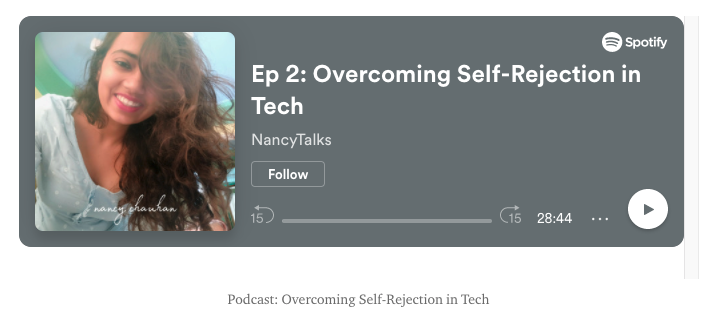
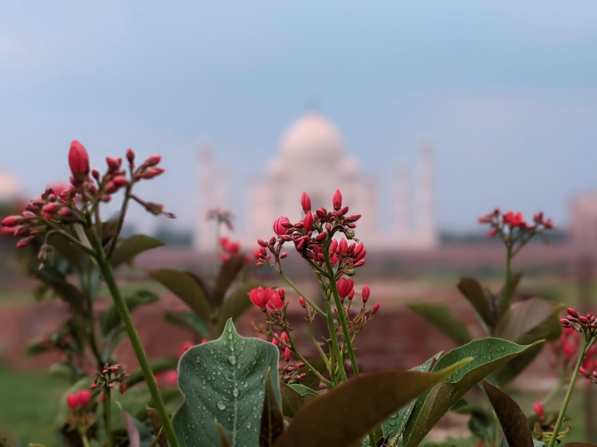

This month has been very special to me. I got a chance to reconnect with people and took a break from work to recharge myself. People think overworking themselves will get more jobs done. But on the contrary, the harder you work without taking a break, the less productive and creative you are.

I was not doing great before July. I constantly pushed myself to work harder until I realized I have been draining my energy, losing my focus, and making my relationships suffer. The moment I realized I have started showing physical signs of stress, I decided to give myself some time off.

It is imperative to take regular breaks in between. Moreover, people shy away from taking time off to address mental health needs or concerns. It is the reason I thought I should be writing about it. We usually know how to keep our electronics recharged, but when it comes to us, we hesitate, and some people make it a “stigma.” Here I am talking about resting for a particular reason: recharge the battery so that you can go and live a more productive life.

# Reconnecting

I spend some time creating art, doing photography, and most importantly, spending time with family and friends. I realized how important it is to make your boundaries; else, it just creates havoc to get reflected differently for different people. For instance, taking your colleagues’ remarks personally or overworking can affect your relationship with your family. We usually tend to give importance to just one thing in our lives, but in reality, life is composed of many little things that make it more beautiful and unique. Hence overlooking those little things is a “Real loss.”

I met many friends and relatives during this time. I tried doing various things and was constantly looking for ideas. One of my favorite strategies for finding new ideas is to get bored out of my mind. Some of the things I worked on last month are as follows :

## Podcast

I created a podcast on “ Overcoming Self-Rejection in Tech” with my friend [Amitosh Swain Mahapatra](https://www.linkedin.com/in/amitosh-swain/)
Here we talk about self-rejection, which everyone faces at one stage of their lives.

 

https://open.spotify.com/episode/0303vzZPAkkOPNrWqhlF5w?go=1&utm_source=embed_v3&t=0&nd=1 

## Art and Photography

I love giving handmade gifts to my close friends and family, and hence I created many small canvas paintings. One thing which I noticed was a drastic change in my color palette. Colors were brighter, happier, and more soothing.

I also did some photography. I believe photography is a great hobby. It allows us to grow as a person, observe things more carefully, and offer so many possibilities for creative expression and technical expertise. One of the primary ways I find photography gratifying is to see the result of my efforts and encourage me to travel and know about new places.

### Experience the magic of Taj
 

### Riding in the rain

### Meet the locals 
 

### Monsoon blooms

### Canvas Paintings 

 
 

## Plants
Plants have been a new addition to my life. It feels happy to see them at your place. They can boost your mood, enhance your creativity, reduce your stress levels and increase your productivity. Moreover, Working with plants can be therapeutic.

# Professional Update

I am excited to begin my new chapter at [Zeotap](https://zeotap.com/company). It has been great working at Grofers. I have seen myself growing at Grofers holistically.

I am Looking forward to new beginnings at Zeotap!

Taking breaks is essential in recovering from stress, which can, in turn, improve your performance. Recovering from work stress can restore energy and decrease the development of fatigue. Taking a break for yourself should be normalized.

