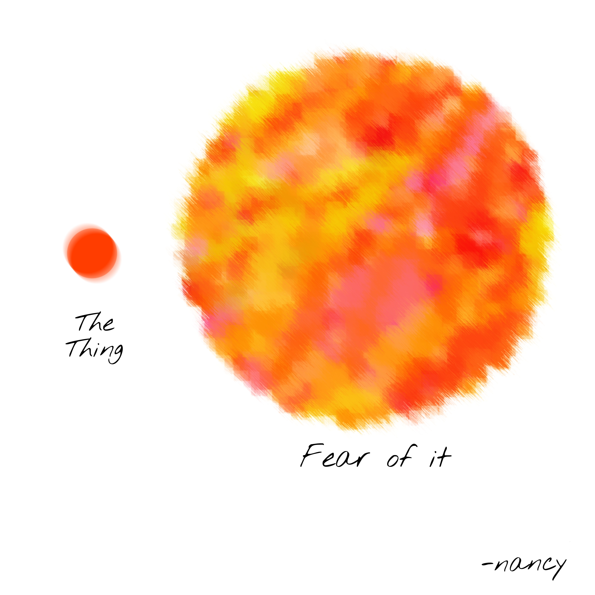
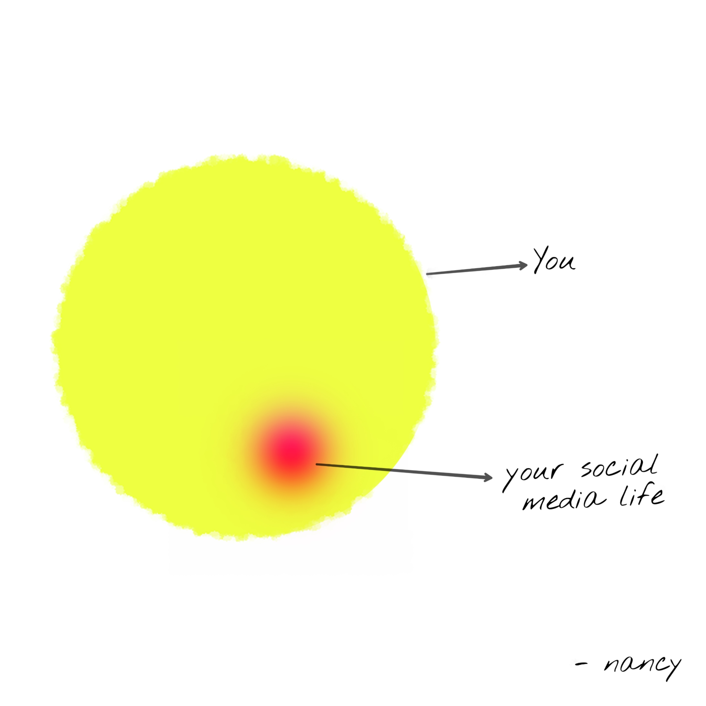
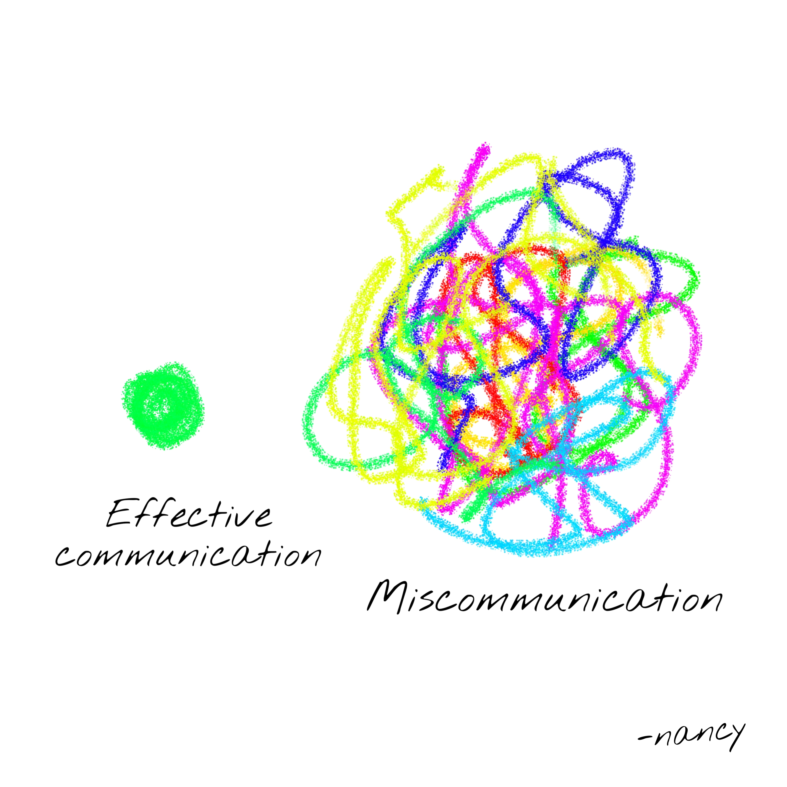
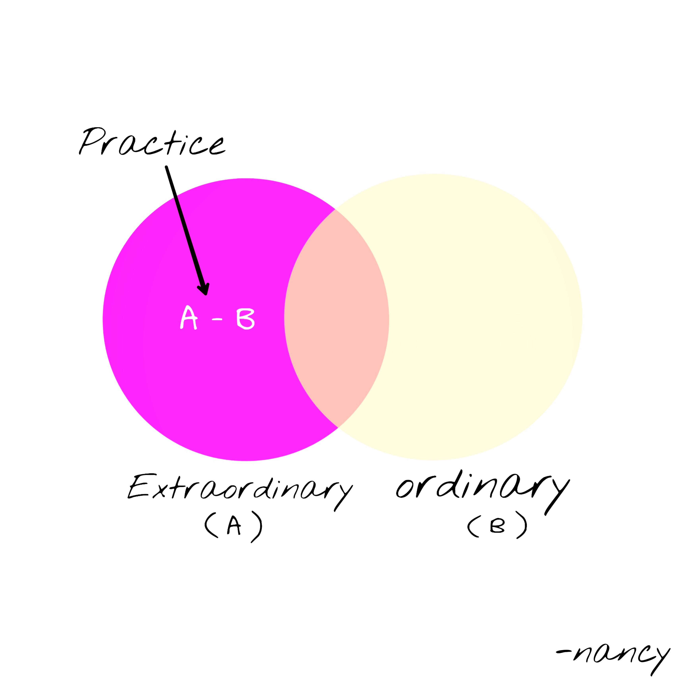
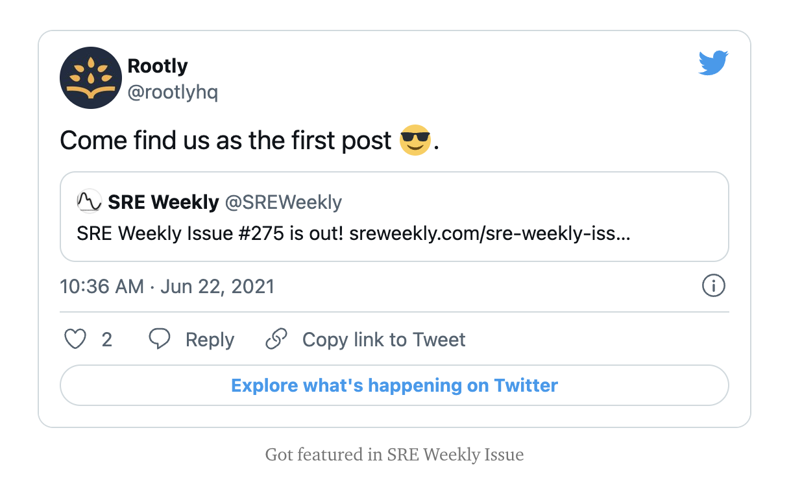

Hi, 2022 👋

2021 had been all about chaos, adapting, supporting each other, taking care of yourself, exploring and prioritising your needs. The first half of 2021 had been quite challenging with a lot of chaos. Human interaction almost went digital. We witnessed the most difficult phase of the pandemic ever. It was all about remaining calm in the storm.

When I look back at the beginning of 2021, I remember I made an overwhelming list of objectives — I achieved some of them, but later I realised I was too hard on myself and wanted to escape from what we all were going through.

I overestimated. I planned a lot of things. I worked hard in the office on some days and did absolutely nothing on others. So it is indeed fine if you are yet not done with 2021. Each one of us, at some point, suffered from the pandemic. We lost our near ones. We were consoling our parents, friends and giving them the strength to remain calm some days.

I lost my beloved uncle. He had been an important part of my childhood. I was seeking closure for a long time as I couldn’t bid bye to him. I always love him.

I believe each of us deserves a shoutout and lots of love for being so brave, humble and supportive. We are more than salary figures, followers or shiny things. We all are winners since we had been a part of a very challenging phase and were able to move on.

As we moved forward, vaccination drive started taking place worldwide. Grateful that most of us got vaccinated. Once I got vaccinated, I started having some small in-person get-togethers.

# Adapting to digitisation

More or less, we got back to a ‘normalised routine’, while trying to adapt to the new normal — Digitisation.

Digitisation is changing the face of where people live and how they work. COVID-19 has turned digitisation from a “nice-to-have” to a “must-have” for most of us. It has also opened a lot of opportunities for everyone. We learned new ways of doing things. We also realised how important our mental well being is.

I started doing digital art and wrote tech blogs to express myself more and reach a broader audience. It seemed pretty fulfilling to me.

I am happy that I continued my tech blogging whenever I got the time. I also got an opportunity to write for Rootly. The most unexpected outcome of this was that one of my blogpost got featured in SRE Weekly.

### Rootly Blog: https://rootly.com/blog/practical-guide-to-sre-incident-severity-levels

# Exploration

In the latter half of 2021, I started exploring different cultures. I switched my job and took a break of 1 month to reconnect with people and get recharged. I have described my experience here:

https://nancy-chauhan.medium.com/thank-you-july-b8058b82bff3

Moving to new cities allowed me to explore different parts of India. I believe art brings different people together, and culture helps appreciate each other with their diversity. It enables us to broaden our horizons.

For me, ‘experience’ matters the most as they stay with us no matter where we go. It broadens our perspective. It helps us feel like our best selves because we are more willing to accept and recognize our shared humanity with others. I am grateful that I could live some experiences by the end of 2021.

# Learnings

## Express

I learnt that it is always good to make that crazy step for your dear ones. Just express your love and care towards them whenever you can. Because life is short and everyone has their timelines. Don’t hesitate to express your love and gratitude for your loved ones.

## Support

It is good to support each other in their bad times. Helping others always makes you feel better.

## Explore, Create experiences

I strongly believe that our lives could be incredibly enjoyable if we try to create experiences.

## Optimise for mental peace

I appreciate that we should constantly try to optimise for our mental peace. It might involve cutting down some people, habits. Sometimes it might involve moving out of your comfort zone. But all this is worth it in the end. Becoming more self-aware and mindful has radically improved my health and wellbeing.

# Thank you, next ( 2o22)
In the end, I am thankful for 2021. It made me wiser. I lost my near ones, but I have learned a lot of things at the same time. Even though I missed out on many objectives, but the most important takeaway is I got to appreciate myself more. This year I just want to explore what I like the most and keep learning and creating experiences.
Thank you for reading. Wish you all a happy new year!
